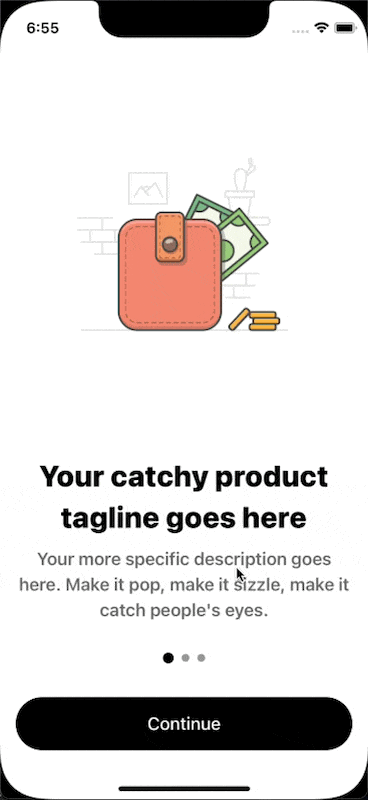

# react-native-onboard

[](https://www.npmjs.com/package/react-native-onboard)
[](https://github.com/FrigadeHQ/react-native-onboard/actions/workflows/tests.yml)
[](https://www.npmjs.com/package/react-native-onboard)
[](https://github.com/prettier/prettier)

Delightful and fully customizable onboarding components for React Native.


See [Live Demo](https://snack.expo.dev/@christian-frigade/react-native-onboard-simple-demo) on Expo Snack.

## Features

- 🎨 Fully customizable components and config
- 🔧 Load images and content from your backend
- 🚀 Works with Expo
- 📦 Very lightweight (~40 kB)
- ✨ Beautiful default UI

## Installation

Install the package with either npm or yarn:

```bash
npm install react-native-onboard
```
or
```bash
yarn add react-native-onboard
```

## Quick start
Place the `OnboardFlow` component anywhere in your app. It will automatically take up the entire screen. To change the 
default behavior, see the [docs on supported props](https://docs.frigade.com/docs/components/highlevel).

```jsx
import { OnboardFlow } from 'react-native-onboard';

const App = () => {
  
  return (
    <OnboardFlow
      pages={[
        {
          title: 'Welcome to my app',
          subtitle: 'This is page 1',
          imageUri: 'https://frigade.com/img/example1.png',
        },
        {
          title: 'Page 2 header',
          subtitle: 'This is page 2',
          imageUri: 'https://frigade.com/img/example2.png',
        }
      ]}
    />
  );
};
```

## Docs
The official docs are available at [docs.frigade.com](https://docs.frigade.com/).

## Customization
`react-native-onboard` is designed to be headless and customizable. You can use the default UI or create your own by
implementing a series of provided interfaces. See the [Official Docs](https://docs.frigade.com/docs/intro) to learn more.



## Updating your onboarding flow without app builds and releases
While the above examples contain hard-coded strings and images for illustrative purposes, we highly recommend loading your strings and presentation
layer logic from your API rather than as plain strings in your app.

[Frigade API](https://frigade.com/) offers a hosted service that allows you to update your onboarding flow without having to push a new app build to the app store while also providing a series of very useful [integrations](https://frigade.com/).

Get started on [Frigade API](https://frigade.com/)


## Get in touch
Questions? Comments? Suggestions? Feel free to [open an issue](https://github.com/FrigadeHQ/react-native-onboard/issues), [submit a PR](https://github.com/FrigadeHQ/react-native-onboard/pulls), or [contact us](https://frigade.com).